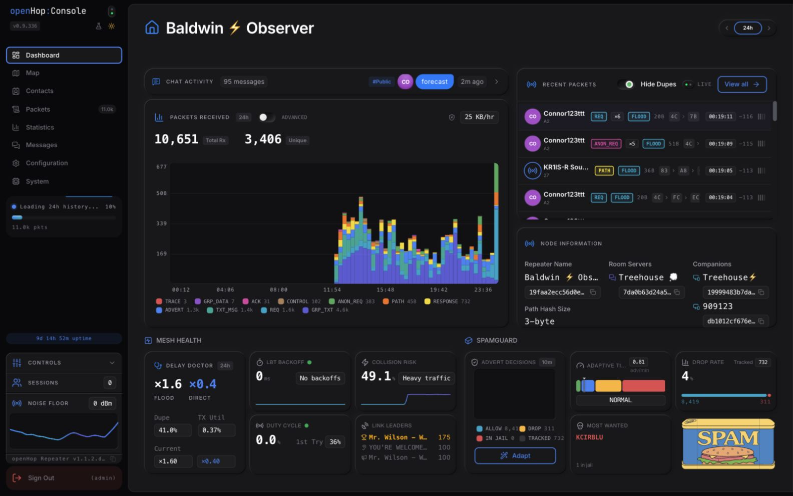
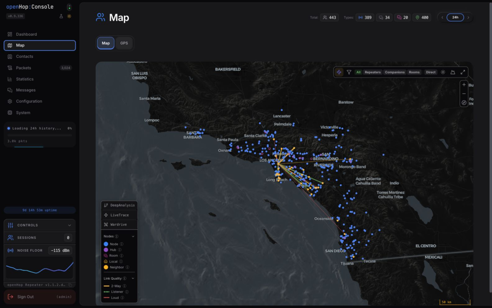
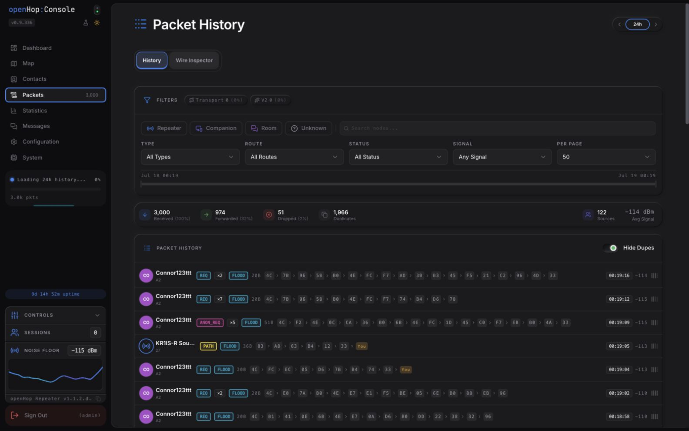
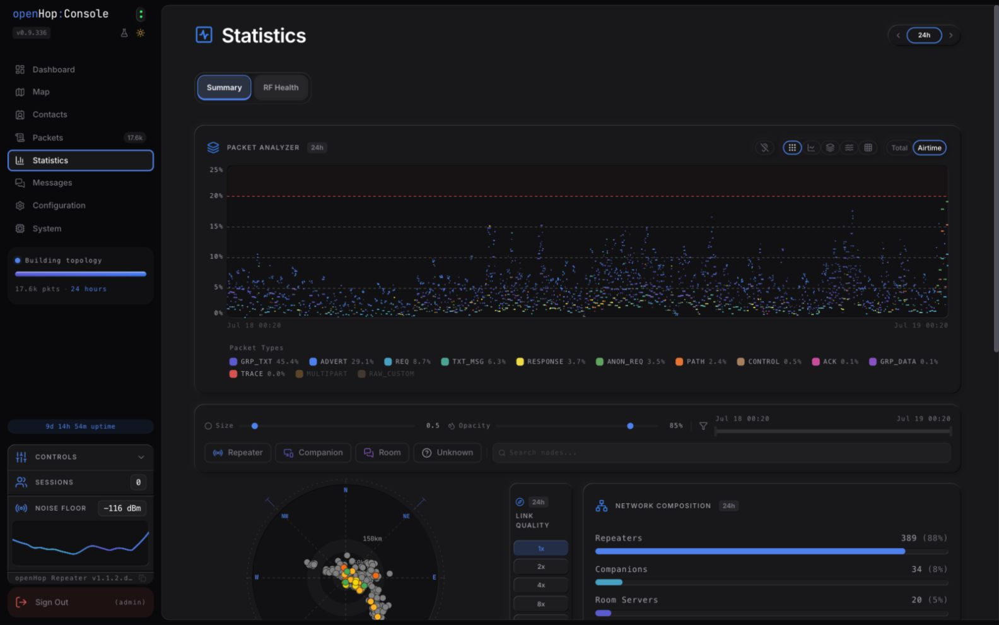

# openHop Console

[](https://github.com/Treehouse-00/pymc_console-dist/releases)
[](LICENSE)

A real-time operations console for [MeshCore](https://meshcore.io/) LoRa mesh repeaters.

openHop Console turns the live API and packet stream from [openHop Repeater](https://github.com/openhop-dev/openhop_repeater) into one browser workspace for network health, packet investigation, mapping, messaging, configuration, and system diagnostics. It is a static React application served by Repeater; it does not replace or fork the Repeater service.



## Current experience

The primary navigation is organized around the tasks operators return to most:

- **Dashboard** — live traffic, recent packets, mesh health, SpamGuard, and node context. On large 16:9 displays it becomes a pane-of-glass view.
- **Map** — contact and link visualization, topology analysis, GPS diagnostics, and wardriving overlays.
- **Contacts** — searchable node inventory with signal, role, recency, and location context.
- **Packets** — packet history plus the byte-level **Wire Inspector**.
- **Statistics** — traffic composition, airtime, RF health, signal quality, and network makeup.
- **Messages** — Companion and Room Server workspaces.
- **Configuration** — repeater, radio hardware, routing policy, observer, and client-access controls.
- **System** — resources, sensors, logs, storage, recovery, diagnostics, and terminal access.

Related tools appear as tabs inside each workspace instead of nested sidebar menus. The left control shelf remains available for uptime, Signal Lab status, session controls, noise-floor telemetry, version information, and sign-out. The same hierarchy is retained at compact mobile breakpoints.

## Install

### Choose a deployment path

| Environment | Console flow |
|---|---|
| Raspberry Pi or Luckfox host | Install openHop Repeater, then install Console with the commands below. |
| Proxmox LXC | Create the Repeater container with the [openHop LXC installer](https://github.com/openhop-dev/openhop_repeater#proxmox-lxc-installation); then install Console if it is not already present. |
| Docker | The `main` and `dev` variants of `openhop/openhop-repeater` already include the matching Console build. No separate Console install is required. |

### 1. Install openHop Repeater

Console requires a working Repeater backend. Follow the [openHop Repeater installation guide](https://github.com/openhop-dev/openhop_repeater), or use its installer:

```bash
git clone https://github.com/openhop-dev/openhop_repeater.git
cd openhop_repeater
sudo bash ./manage.sh install
```

Repeater owns the Python environment, radio and GPIO setup, `/etc/openhop_repeater/config.yaml`, authentication, and the `openhop-repeater` systemd service.

### 2. Install Console

Clone the public distribution repository on the same host:

```bash
cd ~
git clone https://github.com/Treehouse-00/pymc_console-dist.git pymc_console
cd pymc_console
sudo bash manage.sh install
```

The installer:

1. Verifies that openHop Repeater is installed.
2. Downloads the latest `pymc-ui-latest.tar.gz` release.
3. Extracts the static app to `/opt/pymc_console/web/html/`.
4. On a fresh install, sets `web.web_path` in `/etc/openhop_repeater/config.yaml` when `yq` is available.
5. Leaves Repeater, Core, radio configuration, and service lifecycle untouched.

Open `http://<repeater-ip>:8000/` and sign in with the credentials configured for Repeater.

> Port 8000 is intended for a trusted LAN or VPN. Do not expose the Repeater API and Console directly to the public internet.

### Upgrade

```bash
cd ~/pymc_console
sudo bash manage.sh upgrade
```

Upgrade first fast-forwards the local distribution checkout to `origin/main`, then refreshes the dashboard assets from the latest release. The existing `web.web_path` is preserved. Upgrade Repeater separately with the Repeater repository's `manage.sh`.

### Uninstall

```bash
cd ~/pymc_console
sudo bash manage.sh uninstall
```

This removes `/opt/pymc_console` and, after confirmation, the Console checkout. It does not uninstall openHop Repeater or modify its radio setup.

### Automation

Use `--yes`/`-y` or `ASSUME_YES=1` to auto-confirm prompts:

```bash
sudo bash manage.sh --yes install
ASSUME_YES=1 sudo -E bash manage.sh upgrade
```

Set `NO_COLOR=1` for plain output. Run `sudo bash manage.sh --help` for the complete command summary.

## Product tour

### Map and topology



- MapLibre-based contact and path visualization with node-role and link-quality filters
- Deep Analysis using Viterbi HMM path disambiguation for colliding two-character prefixes
- Confidence-weighted topology edges, ghost-node discovery, terrain, and wardriving overlays
- GPS diagnostics within the same Map workspace

### Packet investigation



- Searchable, filterable packet history with route, status, source, and signal context
- Packet detail with resolved paths, hop confidence, payload fields, and raw bytes
- Wire Inspector for the live decode pipeline and byte-level troubleshooting
- Capture and export tools for reproducible diagnostics

### Statistics and RF health



- Traffic and airtime analysis across selectable time windows
- Packet-type distribution, network composition, and link-quality views
- Noise-floor, collision, LBT, and RF-health diagnostics
- Client-side packet cache and analysis pipeline for responsive exploration

### Operations and configuration

- Live Repeater configuration for identity, operating mode, radio settings, routing policy, observer behavior, and client access
- Companion and Room Server messaging tools
- CPU, memory, disk, temperature, sensor, database, backup, log, and recovery views
- Built-in terminal mapped to Repeater API operations
- Breeze Dark and Breeze Light themes with responsive desktop and mobile layouts

## Navigation reference

Top-level routes are stable entry points. Workspace roots redirect to their first actionable view where appropriate.

| Workspace | Entry route | Contextual views |
|---|---|---|
| Dashboard | `/` | Pane-of-glass operational overview |
| Map | `/map` | Map, GPS |
| Contacts | `/contacts` | Contact inventory and detail |
| Packets | `/packets` | History, Wire Inspector (`/packets/raw`) |
| Statistics | `/statistics` | Summary, RF Health |
| Messages | `/messages` | Companion, Room Server |
| Configuration | `/configuration` | Repeater, Radio Hardware, Routing & Policy, Observer, Client Access |
| System | `/system` | Resources, Sensors, Logs, Storage, Recovery, Diagnostics, Terminal |

Legacy direct routes continue to redirect into the current workspace structure. Deprecated experimental views are intentionally omitted from primary navigation.

## Architecture

```text
Browser
  └─ openHop Console (React + TypeScript + Vite)
       ├─ REST API: configuration, history, analytics, system state
       ├─ WebSocket: live radio and packet events
       ├─ IndexedDB: local packet history and analysis cache
       └─ Web workers: bucketing, decoding, and topology analysis
                    │
                    ▼
       openHop Repeater (Python service, port 8000)
       ├─ authentication and API
       ├─ packet forwarding and persistence
       ├─ radio and GPIO control
       └─ openHop Core / MeshCore protocol implementation
```

Console is deployed as static assets under `/opt/pymc_console/web/html/`. Repeater serves the SPA and the same-origin API, which avoids a second production service or cross-origin configuration.

### Analysis pipeline

MeshCore paths contain short node prefixes, so multiple nodes may match a hop. Console uses a Viterbi hidden Markov model to select the most probable path from known candidates plus an unknown-node state. Scoring combines observation recency, prefix co-occurrence, path position, geographic plausibility, and measured edge evidence. The resulting topology powers path confidence, ghost-node discovery, link analysis, and TX-delay recommendations.

The frontend also contains a TypeScript MeshCore protocol implementation for binary frame parsing, packet-type decoding, channel-key derivation, and group-text decryption.

## Management boundaries

`manage.sh` is intentionally Console-only:

| Command | Console action | Repeater impact |
|---|---|---|
| `install` | Installs the latest dashboard into `/opt/pymc_console/web/html/` | Sets `web.web_path` on first install when possible |
| `upgrade` | Self-updates the checkout and replaces dashboard assets | Preserves Repeater configuration and service state |
| `uninstall` | Removes Console assets and its checkout after confirmation | Does not uninstall Repeater |

Use Repeater's installer or standard service tools for backend lifecycle:

```bash
sudo systemctl status openhop-repeater
sudo systemctl restart openhop-repeater
sudo journalctl -u openhop-repeater -f
```

## Troubleshooting

### Console does not load

```bash
sudo systemctl status openhop-repeater
curl -s http://localhost:8000/api/stats | head -c 200
sudo journalctl -u openhop-repeater -n 100
```

Confirm that `/etc/openhop_repeater/config.yaml` contains:

```yaml
web:
  web_path: /opt/pymc_console/web/html
```

If `yq` was unavailable during install, the installer prints the exact command needed to set this value.

### Login fails or the UI and API disagree

Update Repeater and Console independently, then hard-refresh the browser:

```bash
cd ~/openhop_repeater && sudo bash ./manage.sh upgrade
cd ~/pymc_console && sudo bash manage.sh upgrade
```

Use `Cmd+Shift+R` on macOS or `Ctrl+Shift+R` on Linux/Windows to bypass a stale cached `index.html`.

### Console loads but no packets appear

- Allow a fresh Repeater 30–60 seconds to initialize.
- Confirm radio frequency, GPIO, and SPI/USB transport in Repeater configuration.
- Check the live service log with `journalctl`.
- In browser developer tools, verify that the same-origin packet WebSocket remains connected.

## Development

The source repository uses React 18, TypeScript, Vite 6, Zustand, MapLibre GL, µPlot, Cosmograph, and xterm.js.

Installing source dependencies requires access to the Motion+ registry. CI injects the repository's `MOTION_TOKEN` into the `__MOTION_TOKEN__` placeholders in `package.json` and `package-lock.json`; use the same organization credential for a fresh local install.

```bash
git clone https://github.com/Treehouse-00/pymc_console.git
cd pymc_console/frontend
cp .env.example .env.local
# Set VITE_API_URL in .env.local to a running Repeater, then:
npm install
npm run dev
```

Useful checks:

```bash
npm run typecheck
npm run test
npm run lint
npm run build
```

Production builds are written to `frontend/out/`; `npm run build:static` also copies the packaged output to `frontend/dist/`.

## License

MIT — see [LICENSE](LICENSE).

## Credits

- [RightUp](https://github.com/rightup) — creator of the original pyMC Repeater/Core projects and a maintainer of the MeshCore Python ecosystem
- [openHop Repeater](https://github.com/openhop-dev/openhop_repeater) — Repeater daemon and Console backend
- [openHop Core](https://github.com/openhop-dev/openhop_core) — MeshCore protocol library
- [MeshCore](https://meshcore.io/) — MeshCore project and community
- [d40cht/meshcore-connectivity-analysis](https://github.com/d40cht/meshcore-connectivity-analysis) — Viterbi HMM approach for path disambiguation
- [meshcore-bot](https://github.com/agessaman/meshcore-bot) — recency scoring and dual-hop anchor disambiguation
